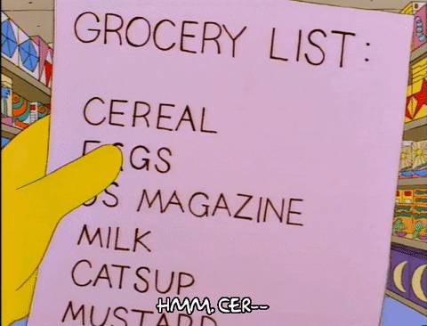
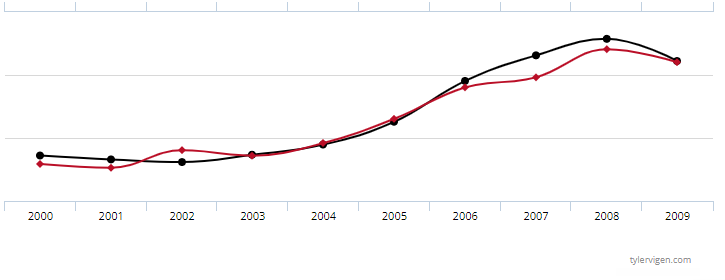
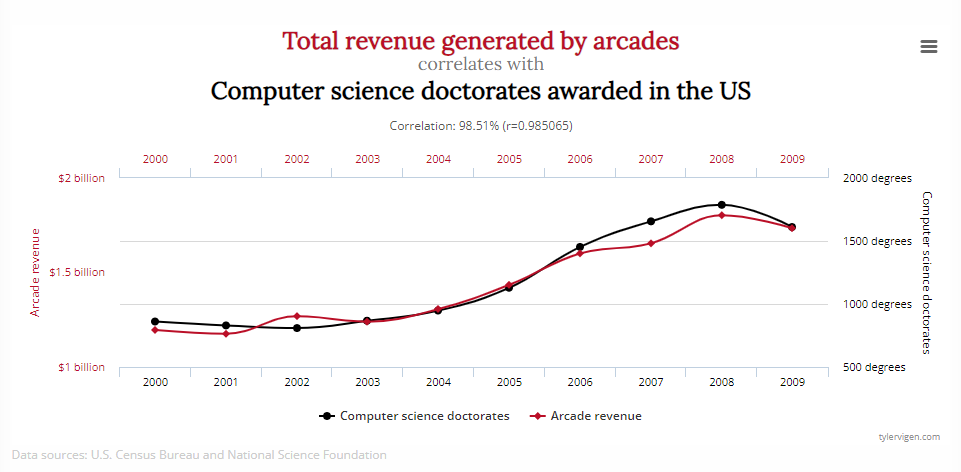
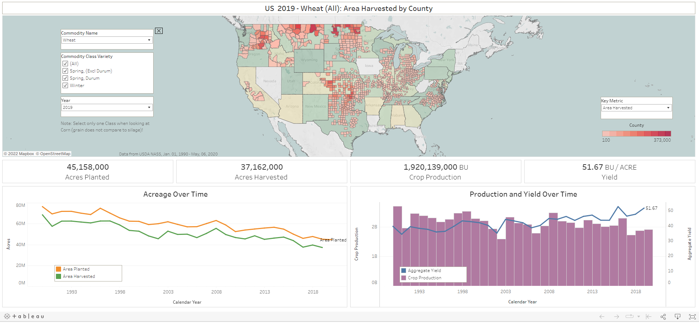

# Plot-a-Thon Data Visualization Festival 2022

Data, analytics, and visualizations. These three elements are at the core of storytelling.

## Data

How many of you use data in your day to day lives? If I had to guess using data...

<details><summary>  it would be 99.99% of everyone on this call </summary>


</details>

Why do we use data?

### Calculated Choices

Decision making situations like:

* time allocation
* budgeting
* grocery shopping
* commuting and traveling



## Analytics

We have goals and objectives for different situations and we want to make informed and optimal choices at scale.

:dart:

First try!

### Trial and Error

```txt
Ever tried.
Ever failed.
No matter.
Try again.
Fail again.
Fail better.
- Samuel Beckett
```

## A Picture is Worth Thousand Words

And often several hundred too many!

### Volume of Information

Sometimes it depends on the audience. Sometimes it's the visual.

<details><summary> Vague </summary>

[](http://www.tylervigen.com/spurious-correlations)

</details>

<details><summary> Detailed </summary>

[](http://www.tylervigen.com/spurious-correlations)

</details>

<details><summary> Overwhelming </summary>

[](https://medium.com/the-marketzones-edge/price-action-trading-the-clean-chart-540ce63be8f8)

</details>

<details><summary> Loaded </summary>


</details>

## Storytelling

Stories need narrative, background, and a connection to an audience for the message to be relatable. Clear and understandable in a short span.

### Chapters

Show different parts of your stories separately is effective. Events happen separately!

Dashboards, separators, text boxes can all help differentiate different sections of information.

[](https://public.tableau.com/views/USAgriculture_15891807504100/UnitedStatesAgriculture?:showVizHome=no&:embed=true)
